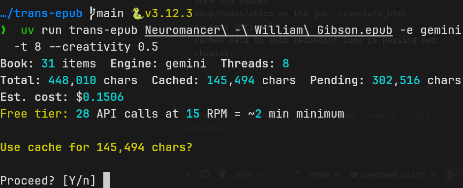

# trans-epub

[](https://www.python.org/downloads/)
[](LICENSE)



Translate EPUB books from English to Vietnamese using AI translation engines.

**Supported Engines:** Azure Translator, Google Gemini, DeepSeek, Alibaba Qwen, Google Cloud Translation, DeepL

## Features

- Multi-engine AI translation (6 engines)
- Parallel processing with progress bars and char/token tracking
- Smart caching — resume interrupted runs, EPUB hash integrity check, atomic writes
- HTML attribute translation — `alt`, `title`, `placeholder`, `aria-label`
- Pronoun matrix / glossary injection with validation and match stats
- Proactive rate limiting — stays under API RPM limits, configurable via `--rpm`
- Configurable batching, threading, creativity/temperature, chapter timeout
- Instant cancellation — Ctrl+C interrupts retry loops immediately

## Prerequisites

- Python 3.13+
- [UV package manager](https://github.com/astral-sh/uv)

## Installation

```bash
git clone https://github.com/fonger900/trans-epub.git
cd trans-epub
uv sync
cp .env.example .env
# Edit .env with your API keys
```

## Usage

```bash
# Basic translation (auto-detects engine from available API keys)
uv run trans-epub book.epub

# With specific engine
uv run trans-epub book.epub -e alibaba

# Translate specific chapters
uv run trans-epub book.epub -i 1-5

# List chapters with char counts
uv run trans-epub book.epub --list

# Custom output path
uv run trans-epub book.epub -o translated.epub

# Parallel threads
uv run trans-epub book.epub -t 8

# Creativity/temperature for LLM engines
uv run trans-epub book.epub --creativity 0.5

# Glossary for consistent character pronouns and terminology
uv run trans-epub book.epub -g glossary.toml

# Fresh translation (ignore cache)
uv run trans-epub book.epub --fresh

# Dry-run: validate glossary, count chars, estimate cost, scan glossary matches
uv run trans-epub book.epub --dry-run

# Override API rate limit (paid tier)
uv run trans-epub book.epub --rpm 60

# Set per-chapter timeout (default: 600s)
uv run trans-epub book.epub --chapter-timeout 300

# Verbose per-request logging
uv run trans-epub book.epub --verbose

# Extra prompt instructions from file
uv run trans-epub book.epub -p instructions.txt
```

## Configuration

### Authentication

Copy `.env.example` and add API keys for your chosen engine(s):

```bash
cp .env.example .env
```

| Engine | Env Variable |
|---|---|
| Azure Translator | `AZURE_TRANSLATOR_KEY` |
| Google Gemini | `GEMINI_API_KEY` |
| DeepSeek | `DEEPSEEK_API_KEY` |
| Alibaba DashScope | `DASHSCOPE_API_KEY` |
| Google Cloud Translation | `GOOGLE_TRANSLATE_API_KEY` |
| DeepL | `DEEPL_API_KEY` |

### Settings

Defaults are built into the CLI:

- `--engine auto` — auto-detects engine from available API keys
- `--threads 4` — concurrent translation threads
- `--creativity` — LLM temperature (engine defaults if not set)

No config file needed. Use CLI flags or environment variables (`TRANS_EPUB_ENGINE`, `TRANS_EPUB_THREADS`, `TRANS_EPUB_CREATIVITY`).

### Glossary (pronoun matrix + terminology)

Ensure consistent character voices with a glossary:

```bash
# Auto-detected from .trans-epub/glossary.toml or ~/.config/trans-epub/glossary.toml
uv run trans-epub book.epub

# Explicit path
uv run trans-epub book.epub -g my-glossary.toml
```

Glossary format (`.toml`):

```toml
[characters.John]
self = "tôi"       # how character refers to themselves
form = "anh"       # how narrator addresses them
narrator = "anh ấy" # how narrator refers to them
note = "ông chủ, ~40 tuổi"

[characters.Mary]
self = "em"
form = "cô ấy"

[terms]
"machine learning" = "học máy"
"the King" = "Nhà vua"
```

See [.trans-epub/glossary.example.toml](.trans-epub/glossary.example.toml) for all options.

## Cost Optimization

| Engine | Approx. Cost | Notes |
|---|---|---|
| Azure Translator | ~$25/million chars | Cheap for bulk, free tier: 2M chars/month |
| Alibaba Qwen | ~$0.80/million chars | Best value, qwen-mt-plus optimized for translation |
| DeepSeek | ~$2/million chars | Often has free tier promotions |
| Google Gemini | ~$1.50/million chars | Free tier: 15 RPM, 250K tokens/min. Check limits. |
| Google Cloud Translation | ~$20/million chars | Premium MT, no LLM overhead |
| DeepL | ~$25/million chars | Free tier: 500K chars/month |

## Resume Capability

Each translated chapter is cached in `{output}.cache.json` with atomic writes:

- **Normal run**: Uses cache to skip already-translated chapters — re-run the same command to resume.
- **EPUB hash check**: Warns if the source EPUB changed since cache was created.
- **Corruption recovery**: Corrupted cache files are detected and replaced automatically.
- **Fresh run**: `--fresh` ignores the cache and translates everything from scratch.
- Cache is never automatically deleted — delete `output.epub.cache.json` manually if needed.

## Developer Documentation

- [Architecture](docs/architecture.md) — code structure, pipeline, threading, known issues
- [Engines](docs/engines.md) — engine registry pattern, adding new engines, retry strategies

## Known Issues / Limitations

- **LLM engines may hallucinate or invent content** at high creativity values. Stick to `--creativity 0.3-0.8` for faithful translation.
- **Very large chapters** (30K+ chars) may hit API token limits especially with glossary + extra prompt. Split the EPUB into smaller sections or use `--chapter-timeout` to skip problematic chapters.
- **Free tier rate limits**: Gemini free tier limits at 15 RPM. Use `--dry-run` to preview batch count and estimated minimum runtime.

## License

MIT — see [LICENSE](LICENSE).

## Support

Open an issue on GitHub.
